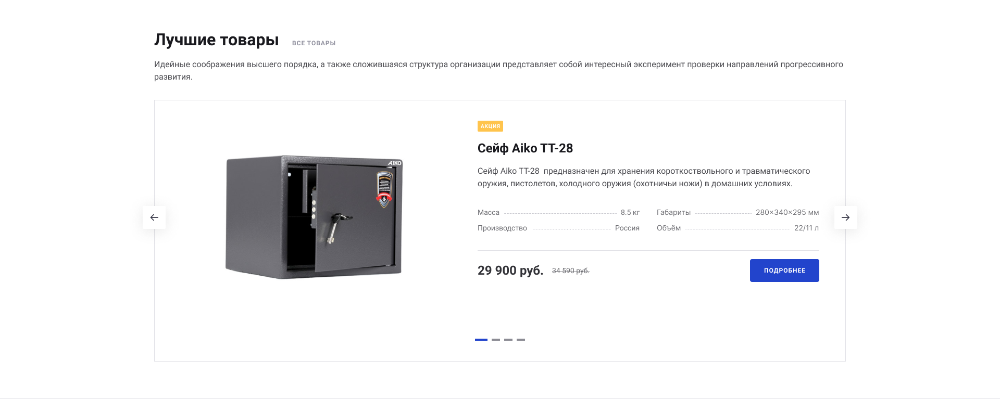

## Тестовое задание: вёрстка секции товаров со слайдером. React

https://iwahid.github.io/nextype_product-slide_react/

#### Макет:
https://www.figma.com/file/sdW6XGBOuVeRYAJtNCmaoU/%D0%9B%D1%83%D1%87%D1%88%D0%B8%D0%B5-%D1%82%D0%BE%D0%B2%D0%B0%D1%80%D1%8B-%E2%80%94-Prime?node-id=0%3A1

(копия макета есть в ресурсах проекта)

 
 
 ____

